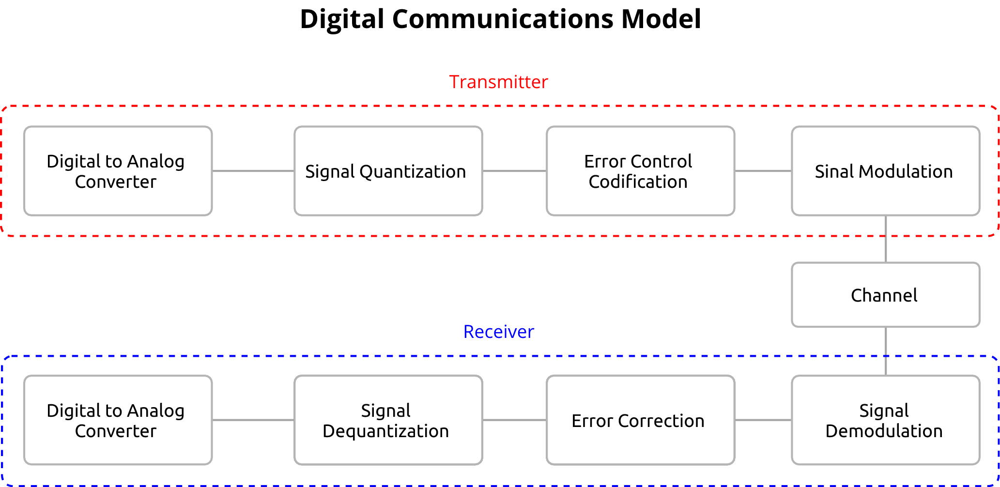
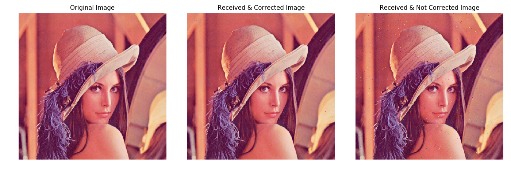

# Signals & Digital Communication

Digital communications is pretty much the way we communicate between devices, either wirelessly or with physical cable, and when it comes to engeneering, it's always interesting to understand how this communication happens. I initially developed this code during the [Signal Processing and Communication](https://www.isel.pt/en/subjects/signal-processing-and-communication-leim) class that i took at ISEL, and been optimizing occasionally. 
The theme of the class revolved around multimedia communications systems, and how this was divided in blocks, that when all put together, had to efficiently process data. In order to apply those concepts, i had to code an entire system, with Python, as a simulation of what would happen with real hardware.

The modules that compose the system are:

1. Sampling (not exactly covered on code)
2. Quantization with Mid-rise and Mid-Tread Quantizer, as well as a minimalistic version of the ITU-T G.771 μ-law
3. Codification/Decodification (convert integers to bits and bits to ints)
4. Error Control Codes, with an Hamming(11,15) as the error-correction code
5. Channel Modulation/Demodulation, using a QPSK as the modulation technique
6. Actual channel simulation, with the implementation of an AWGN Channel

It's also possible to measure the BER and SNR, as well as drawing the constelations.
If you are into actually learning what every block is, i will leave some links here:

 - [QPSK Modulation](https://www.gaussianwaves.com/2010/10/qpsk-modulation-and-demodulation-2/)
 - [Quantization](https://en.wikipedia.org/wiki/Quantization)
 - [Hamming Code](https://www.geeksforgeeks.org/hamming-code-in-computer-network/)
 - [AWGN Channel](https://en.wikipedia.org/wiki/Additive_white_Gaussian_noise)

Even though this code is not fully optimized, it still works. I'm working on improving the perfomance of this, but that might take a while.

This code is compatible with Python 3.7 or newer

## "What's the point of this code" or "What am i seeing?"
Digital communications is everywhere, is in the USB-C port that charges your phone, on the Wifi you are connected to or even on the television you watch. Even though that this is not something you need to know by heart, but can give you some advantage, for example, to when you are complaining about your ISP service. You probably already measured the speed of your internet connection right? That's digital communications, right there!
There are many more applicable uses of these concepts, but many of them are just "in the background", and just sort of happen.

## Output explanation
The ideia on this code is that you transmit a set of data, and on the receptor, you should be able to read that data, and correct any bits that were affected by the noise

When you run the simulation, the code will output some images, one of them is this one:

Notice how one of the images has noise in it. The algorithm should be able to either correct some data or just cause even more error.
In the case above, it corrected almost all of the errors, and was able to almost reconstruct all of the image.

## Usage
Just run the ``simulate.py`` file

# Perfomance results

I'm keeping this table as a reference to the time it took to process an image. With code optimizations this should take less time at every iteration.  
Please note that perfomance is bound to the computer where this script runs, so i included CPU & RAM info.

| Image          | Bits Resolution | Noise | With error correction? | Time to complete (in minutes) | CPU                             | RAM             | 
|----------------|-----------------|-------|------------------------|-------------------------------|---------------------------------|-----------------|
| lena_color.tif | 1               | 3     | Yes                    | 2.8988948663075766            | 2,7 GHz Dual-Core Intel Core i5 | 8 GB 1867 MHz DDR3
| lena_color.tif | 1               | 3     | No                     | 2.183815133571625             | 2,7 GHz Dual-Core Intel Core i5 | 8 GB 1867 MHz DDR3
| lena_color.tif | 8               | 2     | Yes                    | 16.62703206539154             | 2,7 GHz Dual-Core Intel Core i5 | 8 GB 1867 MHz DDR3
| lena_color.tif | 8               | 2     | No                     | 9.562310695648193             | 2,7 GHz Dual-Core Intel Core i5 | 8 GB 1867 MHz DDR3

## TODO

Process audio with this script  
More modulation techniques  
DPCM Encoding/Decoding.  
More types of CRC's   
Translate code to english (is this even a todo?)  

Loop optimization. At the current state, this code takes some time to perform, and the issue is on the loop of the individual modules. 
The ideia is to vectorize pretty much every function that i can, so the code performs better.  
